# PetShop
宠物商城系统带项目论文和ppt，基于ssm+jsp的宠物商店系统，基于spring+springmvc+mybatis+jsp的宠物交易管理系统，java项目，ssm项目，jsp项目

### 完整项目获取

通过网盘分享的文件：在线宠物商店

链接: https://pan.baidu.com/s/1RgBoBd8dFmu9jrgRj0Bo8A?pwd=anut 提取码: anut
--来自百度网盘超级会员v3的分享

### 项目合集(项目不断更新中，包含java、vue、python、Android、微信小程序等项目)

链接: https://pan.baidu.com/s/1nY-zhvAK0CXYcn3g7LzQnQ?pwd=id3c 提取码: id3c
--来自百度网盘超级会员v3的分享

### 工具包

链接: https://pan.baidu.com/s/1YmdoJvkjoUjA75wvHLDZ6A?pwd=xm96 提取码: xm96
--来自百度网盘超级会员v3的分享

需要远程项目部署或项目修改和毕业设计也可联系（添加申请时请备注好来意）

### 远程调试部署联系方式

链接: https://pan.baidu.com/s/1W0dDcoZmayG0c7USJDYBYg?pwd=nqd7 提取码: nqd7
--来自百度网盘超级会员v3的分享

#### 这些项目一起发你了 可以分享给你需要的同学 调试可找我 也接二次修改和项目定制、毕业设计等

## 接毕业设计和论文

微信联系方式：xzxj0206  QQ：3808981644   (支持修改、 部署调试、 支持代做毕设)

接网站建设、小程序、H5、APP、各种系统等，单片机、嵌入式也可以做

选题+开题报告+任务书+程序定制+安装调试+论文+答辩ppt  都可以做

## 一、介绍

java jsp宠物商城系统带7000字文档和20页ppt java项目ssm项目jsp项目

语言: Java 数据库：MySQL

技术栈： JSP + Spring+Spring MVC+Mybatis

系统角色：管理员、用户

管理员：登录、订单管理、客户管理、商品管理、类目管理、修改密码

用户：注册、登录、首页、商品分类、热销、新品、
加入购物车、提交订单、查看订单

## 二、7ooo字文档和ppt

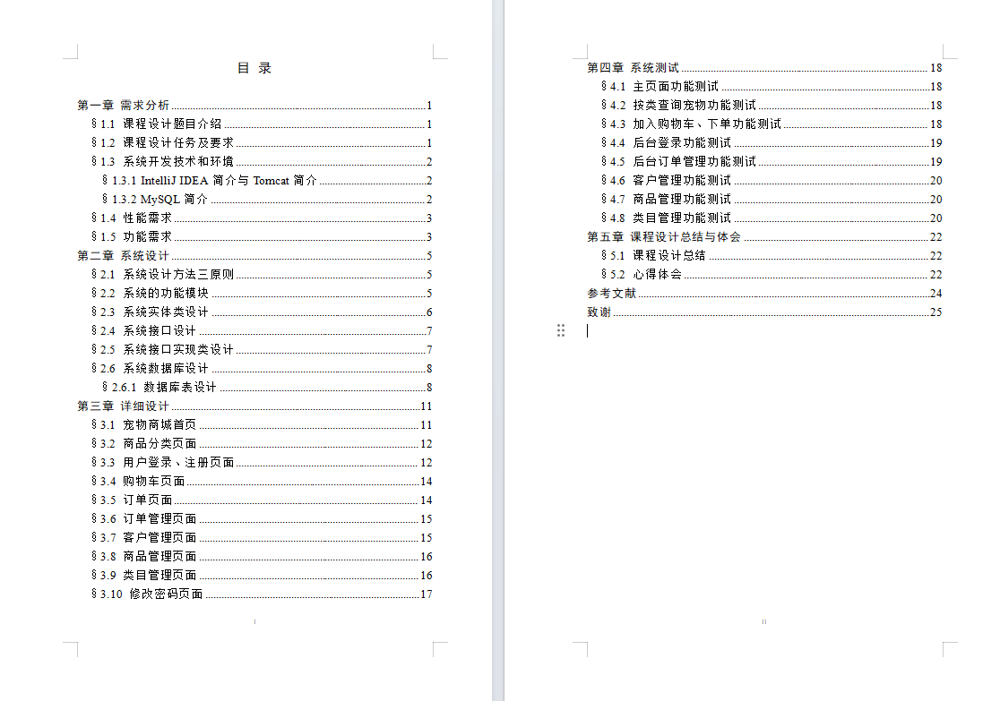

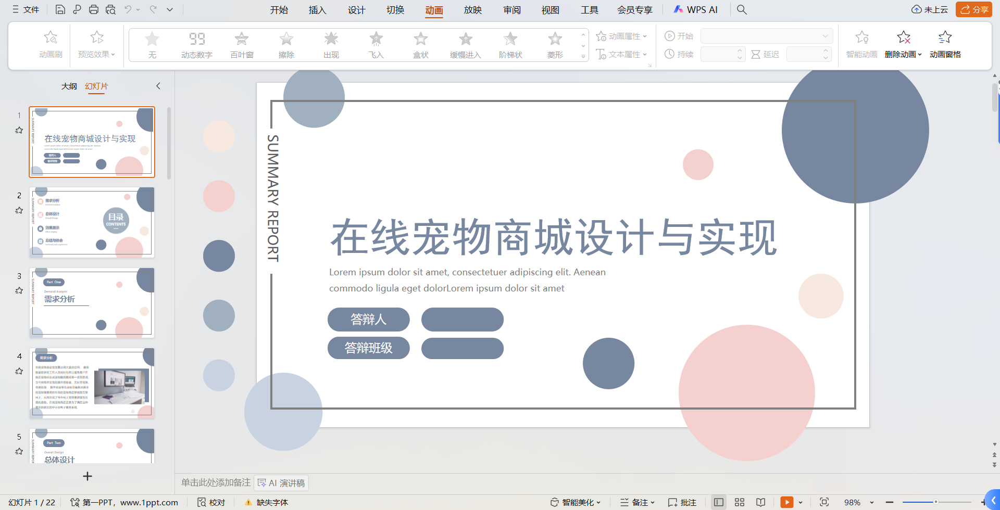

## 三、系统运行界面

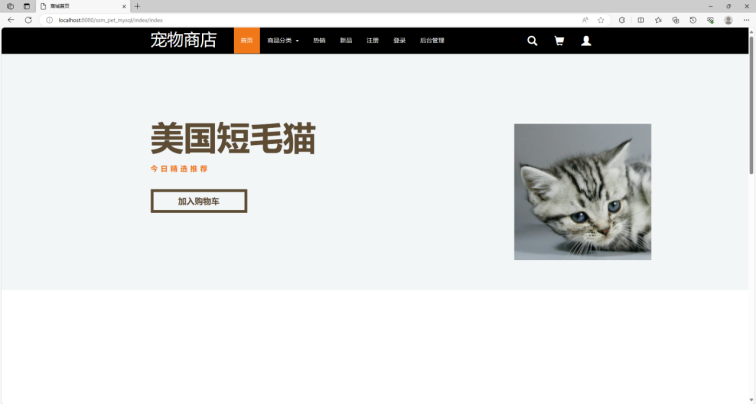

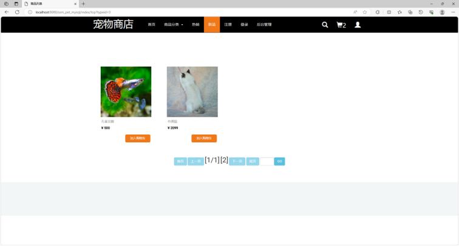

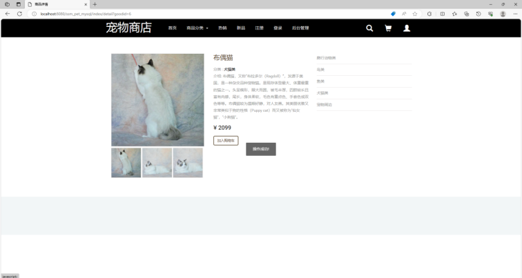

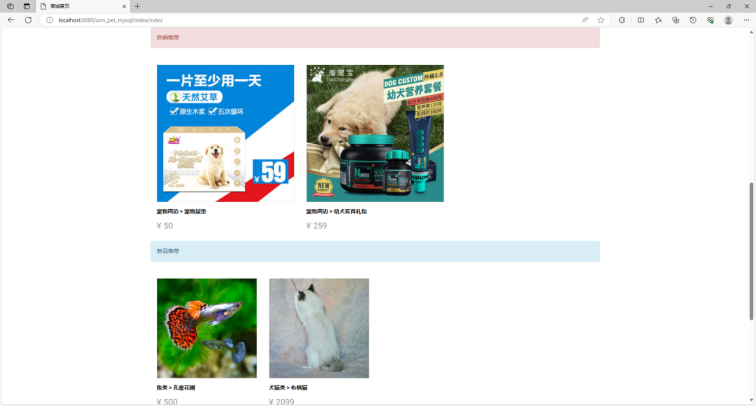

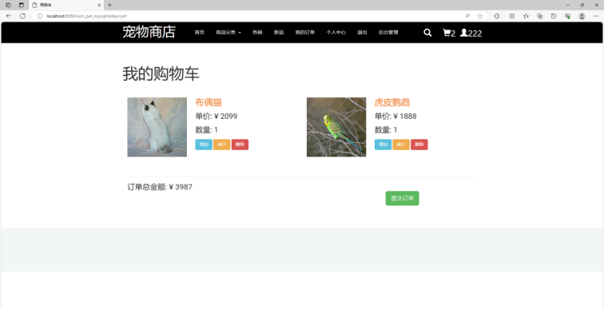

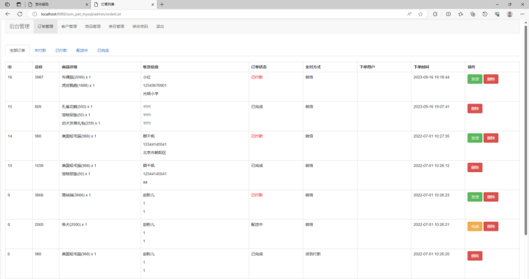

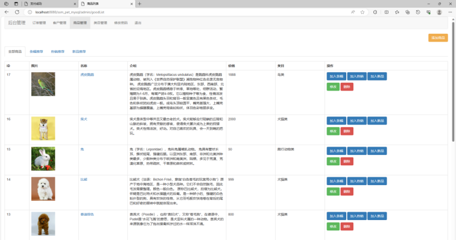

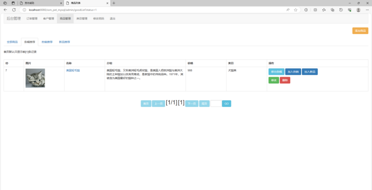

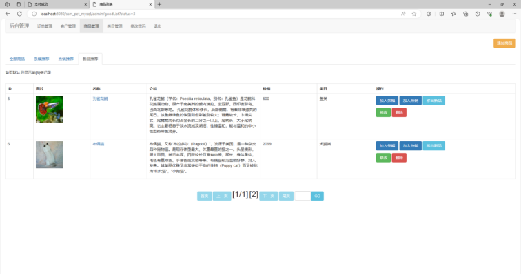

